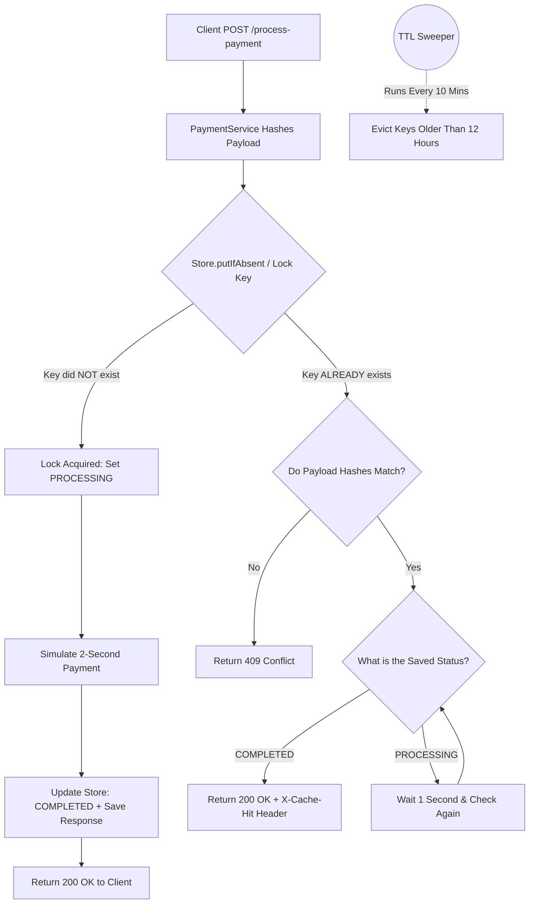

# Idempotency Gateway (The "Pay-Once" Protocol)

A resilient, Spring Boot-based middleware service designed to completely eliminate the "double-charging" problem in payment processing. This gateway intercepts incoming HTTP requests, safely locks transactions using an atomic in-memory cache, and guarantees that duplicate network retries are handled safely without reprocessing the payment.

## 1. Architecture Diagram

The system uses a `ConcurrentHashMap` for atomic locking, ensuring thread safety against race conditions.
  


## 2. Setup Instructions

This microservice is built with Java and Spring Boot. It uses `ConcurrentHashMap` for atomic locking, making it easy to test and deploy.

**Prerequisites:**
- Java 17 or higher
- Maven

**To run the application locally:**
1. Clone the repository.
2. Navigate to the root directory in your terminal. 
`cd backend/Idempotency-gateway`
3. Execute the following Maven wrapper command:

```bash
./mvnw spring-boot:run
```

The server will boot up natively on port 8081 you can change it in `application.properties` to any port you want.

**To run using Docker:**
1. Build the Docker image:
```bash
cd backend/Idempotency-gateway
docker build -t idempotency-gateway .
```
2. Run the Docker container:
```bash
docker run -p 8081:8081 idempotency-gateway
```


## 3. API Documentation

**Endpoint**
`POST /api/v1/payments/process-payment`

**Headers Required**
- `Content-Type: application/json`
- `Idempotency-Key: <unique-uuid-string>`

### Scenario A: First Transaction (Happy Path)
Simulates a payment processing delay and saves the result.

**Request:**
```bash
curl -i -X POST http://localhost:8081/api/v1/payments/process-payment \
  -H "Content-Type: application/json" \
  -H "Idempotency-Key: test-key-123" \
  -d '{"amount": 100, "currency": "GHS"}'
```

**Response:** `200 OK`
```text
Charged 100 GHS
```

### Scenario B: Duplicate Retry (Cache Hit)
If a network timeout occurs and the client safely retries the exact same request.

**Response:** `200 OK`
Includes Header: `X-Cache-Hit: true`
```text
Charged 100 GHS
```

### Scenario C: Payload Mismatch (Fraud Check)
If a malicious actor attempts to reuse a valid key but alters the payment amount.

**Request:**
```bash
curl -i -X POST http://localhost:8081/api/v1/payments/process-payment \
  -H "Content-Type: application/json" \
  -H "Idempotency-Key: test-key-123" \
  -d '{"amount": 5000, "currency": "GHS"}'
```

**Response:** `409 Conflict`
```text
Idempotency key already used for a different request body.
```

## 4. Design Decisions

- **In-Memory Datastore:** Chose Java's native `ConcurrentHashMap` over external dependencies like Redis to guarantee zero-friction testing and deployment while maintaining strict thread safety.
- **Atomic Locking:** Utilized the `.putIfAbsent()` method to ensure that if hundreds of requests arrive at the exact same nanosecond, the Java Virtual Machine guarantees only one thread can successfully acquire the processing lock.
- **Polling with Backoff:** To handle "in-flight" race conditions (where Request B arrives while Request A is still processing), Request B is routed into a polite while loop with a 1-second `Thread.sleep()`. This polling backoff protects the server's CPU from busy-waiting while securely returning the synchronized response.
- **Backend Payload Hashing:** Payload hashing is done strictly on the backend via the Service layer. Trusting the client to hash their own payload introduces a vulnerability where a bad actor could spoof a matched hash for an altered payload.

## 5. The Developer's Choice: TTL Cache Eviction Sweeper

**The Problem:** In a high-traffic FinTech application, storing idempotency keys in memory is a critical liability that will inevitably result in a fatal `OutOfMemoryError`. Idempotency keys are only necessary during the immediate window of network retries.

**The Solution:** I implemented a background scheduled task (`@Scheduled`) that acts as a Time-To-Live (TTL) Sweeper. It wakes up every 10 minutes, iterates through the `ConcurrentHashMap`, and safely evicts any transaction records older than 12 hours.

**The Result:** This ensures the application maintains a lightweight memory footprint and remains highly performant in a production environment, while still providing a massive 12-hour safety net for duplicate requests and network timeouts.

**Note:** the render service will take too long to load due to free plan limitations.
